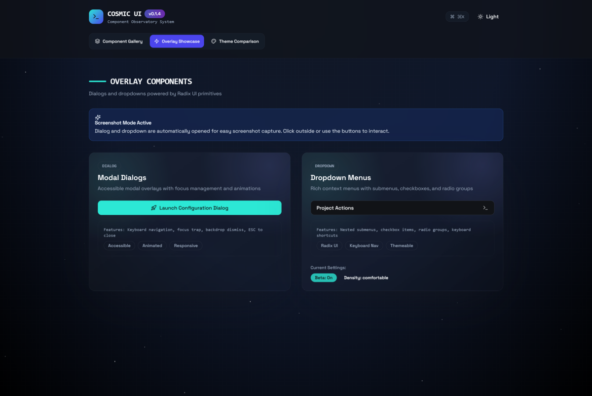
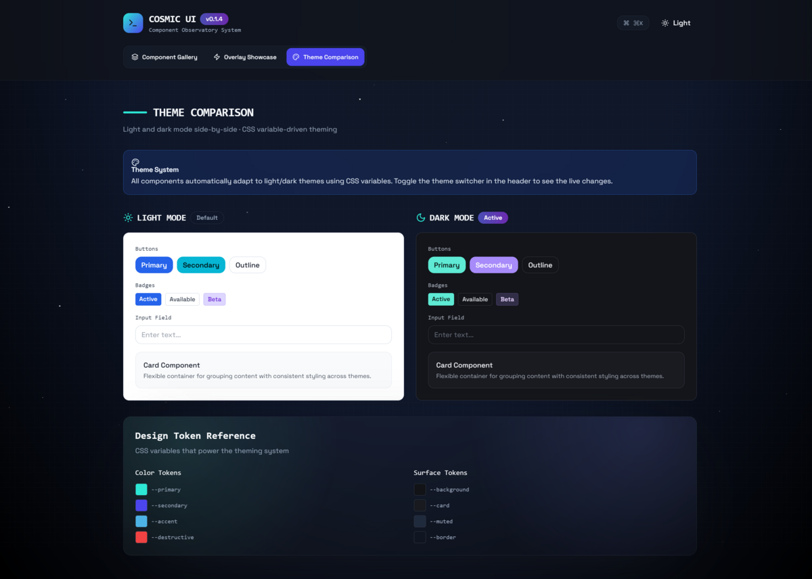

# Cosmic UI

Lightweight, themeable React UI primitives built for Tailwind-based apps: Buttons, Cards, Badges, Dialogs, Selects, Dropdown menus, Tables, and more. Styling is driven by design tokens (CSS variables) so you can swap themes without rewriting components.

## Screenshots
Add your images to `docs/screenshots/` and replace these placeholders.





## What You Get
- Accessible primitives powered by Radix UI (Dialog, Select, Dropdown Menu).
- Variant-based styling with `class-variance-authority` (consistent variants across components).
- Tailwind-friendly class merging via `clsx` + `tailwind-merge` (exported as `cn`).
- Fully typed TypeScript exports + tree-shakeable builds (ESM/CJS + `.d.ts`).
- A tiny token layer (`theme.css`) with light defaults and dark overrides.

## Tech Stack
- React `^18 || ^19` (peer dependencies), TypeScript
- Bundling: `tsup` (ESM + CJS + types + sourcemaps)
- UI primitives: Radix UI (`@radix-ui/*`)
- Styling utilities: `class-variance-authority`, `clsx`, `tailwind-merge`
- Icons/toasts: `lucide-react`, `sonner`
- Publishing: npmjs (`https://registry.npmjs.org/`)

## Install
```sh
npm install @stargazers-stella/cosmic-ui
```

## Theme Tokens
Import the token sheet once in your app entry/global styles:

```ts
import "@stargazers-stella/cosmic-ui/theme.css";
```

- Light defaults live on `:root`; dark overrides live on `.dark`.
- Toggle the `dark` class on `<html>` or `<body>` to switch themes.
- Helpers included: `.surface`, `.surface-strong`, `.surface-muted`, `.surface-inset`.
- `--radius` controls border radii for cards/controls.

If you already have a token system, override the CSS variables instead of importing `theme.css`.

## Usage
```tsx
import { Badge, Button, Card, CardContent } from "@stargazers-stella/cosmic-ui";

export function Example() {
  return (
    <Card className="max-w-sm">
      <CardContent className="space-y-3">
        <Badge variant="glow">Signal</Badge>
        <p className="text-sm text-muted-foreground">
          Cosmic UI stays themeable via CSS variables.
        </p>
        <Button>Action</Button>
      </CardContent>
    </Card>
  );
}
```

The library also exports `cn` for class merging:
```ts
import { cn } from "@stargazers-stella/cosmic-ui";
```

## Component Index
Exported from `src/index.ts`:
- `Alert`, `Badge`, `Button`, `Card`
- `Command` (cmdk)
- `Dialog`, `DropdownMenu`, `Select`
- `Input`, `Textarea`, `Table`
- `Toaster` (sonner) and helpers

## Notes (Next.js / RSC)
Most components include `"use client"` at the top of the module. In Next.js App Router, import and use them from Client Components.

## Development
```sh
npm install
npm run build
```

Output goes to `dist/` (`dist/index.js`, `dist/index.cjs`, `dist/index.d.ts`).
